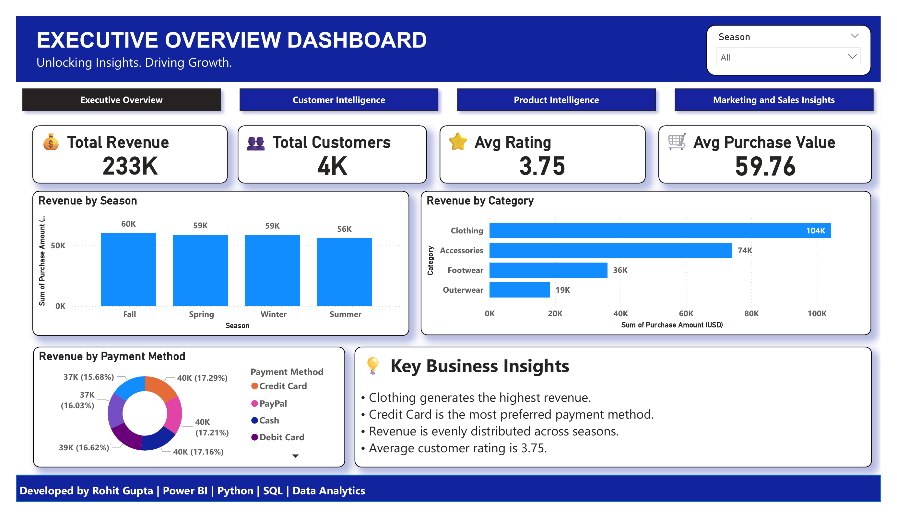
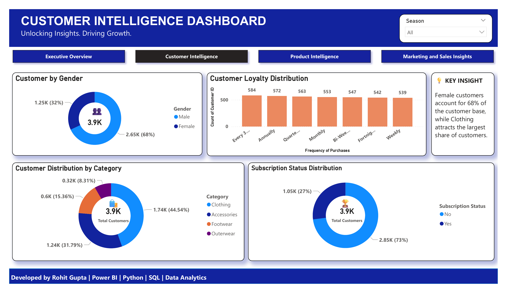
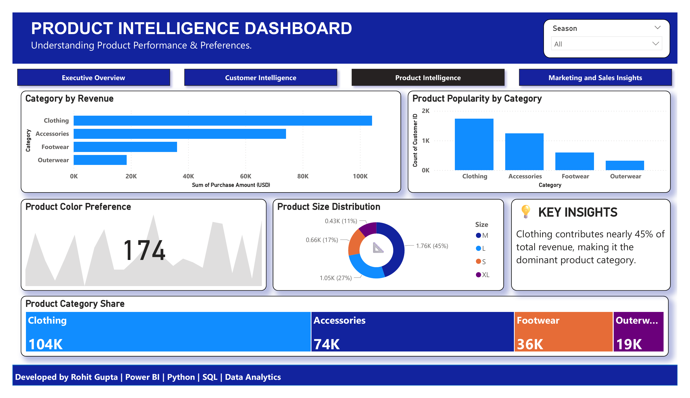
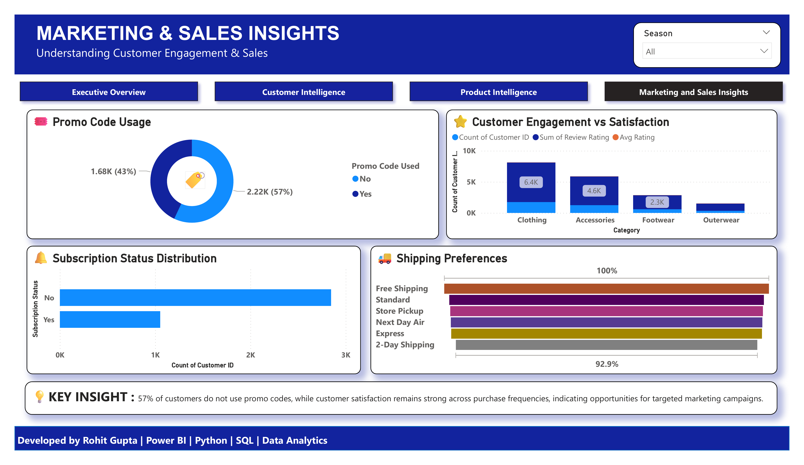

# 📊 Customer Purchase Intelligence Platform

An end-to-end Data Analytics project that analyzes customer purchasing behavior using Python, SQL, and Power BI. The project provides actionable business insights through interactive dashboards, customer segmentation, product analysis, and marketing intelligence.

---

## 🚀 Project Highlights

- Analyzed 3,900+ customer purchase records
- Built a 4-page interactive Power BI dashboard
- Performed customer segmentation and loyalty analysis
- Conducted product performance and category analysis
- Generated marketing and sales insights
- Created business recommendations through KPI tracking
- Used Python, SQL, Pandas, Jupyter Notebook, and Power BI

---

## 🛠️ Tools & Technologies

- Python
- Pandas
- NumPy
- SQL
- Jupyter Notebook
- Power BI
- Data Visualization
- Business Intelligence

---

## 📁 Project Structure

```text
Customer-Purchase-Intelligence-Platform
│
├── Dashboard
│   ├── Customer_Purchase_Intelligence.pdf
│   ├── dashboard_page_1.png
│   ├── dashboard_page_2.png
│   ├── dashboard_page_3.png
│   └── Page4_Marketing_Sales_Insights.png
│
├── Customer_Purchase_Intelligence.ipynb
├── Customer_Purchase_Intelligence.pbix
├── advanced_business_queries.sql
└── README.md
```

---

## 📊 Dashboard Preview

### Executive Overview



### Customer Intelligence



### Product Intelligence



### Marketing & Sales Insights



---

## 📈 Dashboard Pages

### 1️⃣ Executive Overview

- Revenue Analysis
- Customer Metrics
- Revenue by Category
- Revenue by Season
- Payment Method Analysis
- Business Insights

### 2️⃣ Customer Intelligence

- Customer Gender Distribution
- Purchase Frequency Analysis
- Customer Category Distribution
- Subscription Analysis
- Customer Insights

### 3️⃣ Product Intelligence

- Category Revenue Analysis
- Product Popularity
- Color Preferences
- Size Distribution
- Product Category Share
- Product Insights

### 4️⃣ Marketing & Sales Insights

- Promo Code Usage
- Customer Engagement Analysis
- Subscription Status Analysis
- Shipping Preferences
- Marketing Insights

---

## 📌 Key Business Insights

- Clothing generates the highest revenue among all product categories.
- Credit Card is the most preferred payment method.
- Female customers represent the majority of the customer base.
- Most customers do not use promo codes, indicating potential opportunities for targeted campaigns.
- Customer purchasing behavior remains consistent across seasons.
- Clothing contributes nearly 45% of total revenue.

---

## 📂 Files Included

### Python Analysis

- Data Cleaning
- Data Exploration
- Feature Engineering
- Business Analytics

### SQL Analysis

- Advanced Business Queries
- Revenue Analysis
- Customer Insights
- Product Performance Analysis

### Power BI Dashboard

- Interactive Visualizations
- KPI Cards
- Slicers and Filters
- Business Insights
- Multi-page Reporting

---

## 🎯 Business Objectives

- Understand customer purchasing patterns
- Identify high-performing product categories
- Analyze customer loyalty and engagement
- Evaluate marketing effectiveness
- Support data-driven business decisions

---

## 👨‍💻 Author

**Rohit Gupta**

B.Tech Computer Science & Engineering (2023–2027)  
Galgotias University

### Skills

Python | SQL | Power BI | Data Analytics | Data Visualization | Business Intelligence

---

## ⭐ If you found this project useful

Please consider giving the repository a star.
